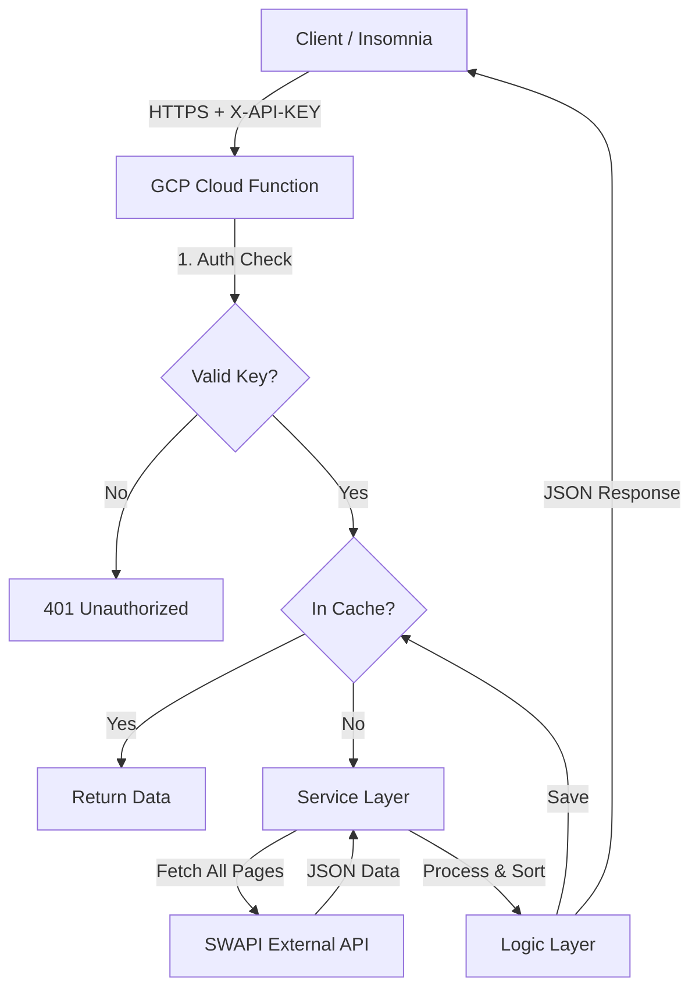

# Star Wars Explorer API 🌌

Serverless API built for the **PowerOfData** technical challenge, designed to provide a
rich and interactive interface for exploring the Star Wars universe. It features advanced
filtering, smart sorting logic for paginated data, and in-memory caching for high performance.

## 🚀 Live Demo

You can access the production API deployed on Google Cloud Platform here:

**Base URL:** `https://star-wars-api-xst3xocumq-uc.a.run.app`

> **Authentication Required:**
> All requests must include the security header:
> `X-API-KEY: star-wars-secret-key`

## 🛠️ Architecture & Tech Stack

This project follows a **Serverless First** approach, ensuring scalability and zero
maintenance costs when idle.

* **Language:** Python 3.11
* **Cloud:** Google Cloud Functions (2nd Gen)
* **Framework:** Flask (via Google Functions Framework)
* **Testing:** Pytest & Unittest (Mocks)
* **Security:** Application-Level API Key Authentication

### Architecture Diagram



## ✨ Key Features

1. **"Fetch All" Strategy:** Overcomes the pagination limits of the external API. When sorting or
filtering is requested, the system intelligently aggregates all pages to ensure the entire
dataset is processed, not just the current page.


2. **Smart Caching:** An in-memory cache layer (TTL 5 minutes) drastically reduces latency for
repeated queries and saves network resources.


3. **Numeric Sorting:** Implements robust logic to handle numeric strings correctly (e.g., "100"
is treated as greater than "20") and places unknown or n/a values at the end of the list.


4. **Security:** Custom decorator for API Key validation, protecting the endpoint from unauthorized
access.

## 📖 API Reference

The API adheres to the OpenAPI 2.0 specification. See `openapi.yaml` for the full definition.

### Authentication

All requests must include the header: `X-API-KEY: star-wars-secret-key`

### Endpoint: `GET/`

This is the main entry point used to query different resources.

### Query Parameters:

| Parameter        | Type   | Required | Description                                                                 | Example              |
|------------------|--------|----------|-----------------------------------------------------------------------------|----------------------|
| `resource`         | `string` | No       | The Star Wars category to fetch (people, planets, starships, films, species, vehicles). Default: `people` | `resource=planets` |
| `page`             | `int`    | No       | Page number. Note: Only works if no filter/sort is applied.             | `page=2`             |
| `search`           | `string` | No       | Search text within the resource name (e.g., specific character name).       | `search=Vader`       |
| `order_by`         | `string` | No       | Attribute to sort the results by.                                         | `order_by=mass`      |
| `direction`        | `string` | No       | Sort direction: `asc` (ascending) or `desc` (descending). Default: `asc`    | `direction=desc`     |
| `filter_key`       | `string` | No       | Exact attribute name to apply a strict filter.                              | `filter_key=gender`  |
| `filter_value`     | `string` | No       | Exact value to match in the filter.                                         | `filter_value=female`|

### Usage Examples

1. Get all Starships sorted by cost (descending):

```bash
curl -X GET "[https://star-wars-api-xst3xocumq-uc.a.run.app/?resource=starships&order_by=cost_in_credits&direction=desc](https://star-wars-api-xst3xocumq-uc.a.run.app/?resource=starships&order_by=cost_in_credits&direction=desc)" \
     -H "X-API-KEY: star-wars-secret-key"
```

2. Find characters with specific gender:

```bash
curl -X GET "[https://star-wars-api-xst3xocumq-uc.a.run.app/?resource=people&filter_key=gender&filter_value=n/a](https://star-wars-api-xst3xocumq-uc.a.run.app/?resource=people&filter_key=gender&filter_value=n/a)" \
     -H "X-API-KEY: star-wars-secret-key"
```

## ⚙️ Local Development

To run this project locally:

1. Clone & Install Dependencies:

```bash
git clone https://github.com/pedrohenriqux/challenge-power-data.git
cd src
pip install -r requirements.txt
```

2. Run the Server:

```bash
functions-framework --target star_wars_api --debug
```

3. Run Tests:

```bash
pytest
```

## 🏛️ Architectural Decisions & Trade-offs
* API Gateway: For this MVP release, authentication was implemented at the application layer to
optimize delivery time and infrastructure complexity. An `openapi.yaml` file is included in the
root directory, making the project ready for immediate import into GCP API Gateway for future scaling.


* Cache: An in-memory dictionary was chosen over Redis (Memorystore) to keep the solution fully Serverless
and cost-free for the expected traffic volume of the assessment.


* Correlated Data: To ensure fast response times, the API returns URLs for related resources (like films/vehicles)
rather than resolving names recursively, which would significantly degrade performance without a complex asynchronous architecture.

---
Developed by Pedro H. Sousa for the PowerOfData Challenge.