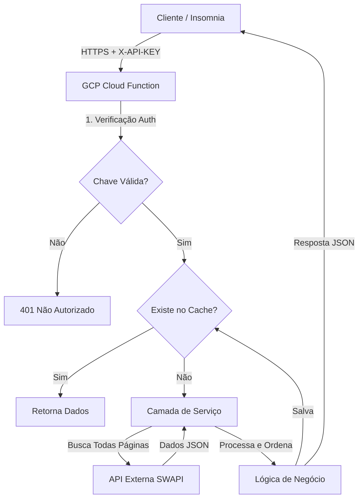

# Star Wars Explorer API 🌌

API Serverless desenvolvida para o desafio técnico da **PowerOfData**, projetada para oferecer uma interface rica e interativa
para exploração do universo Star Wars. O projeto conta com filtros avançados, lógica inteligente de ordenação para dados paginados
e cache em memória para alta performance.

## 🚀 Demonstração Online (Live Demo)

Você pode acessar a API em produção no Google Cloud Platform através do link:

**URL Base:** `https://star-wars-api-xst3xocumq-uc.a.run.app`

> **Autenticação Necessária:**
> Todas as requisições devem incluir o cabeçalho de segurança:
> `X-API-KEY: star-wars-secret-key`

## 🛠️ Arquitetura e Tecnologias

Este projeto segue uma abordagem **Serverless First**, garantindo escalabilidade automática e custo zero de manutenção quando ocioso.

* **Linguagem:** Python 3.11
* **Cloud:** Google Cloud Functions (2ª Geração)
* **Framework:** Flask (via Google Functions Framework)
* **Testes:** Pytest e Unittest (Mocks)
* **Segurança:** Autenticação via API Key em nível de aplicação

### Diagrama de Arquitetura



## ✨ Funcionalidades Principais

1. **Estratégia "Fetch All":** Supera as limitações de paginação da API externa. Quando uma ordenação ou filtro é solicitado,
o sistema agrega inteligentemente todas as páginas para garantir que o conjunto de dados inteiro seja processado, e não
apenas a página atual.


2. **Cache Inteligente:** Uma camada de cache em memória (TTL de 5 minutos) reduz drasticamente a latência para consultas repetidas
e economiza recursos de rede.


3. Ordenação Numérica: Implementa lógica robusta para tratar strings numéricas corretamente (ex: "100" é tratado como maior que "20")
e posiciona valores `unknown` ou `n/a` no final da lista.


4. **Segurança:** Decorator personalizado para validação de API Key, protegendo o endpoint contra acesso não autorizado.

## 📖 Referência da API

A API adere à especificação OpenAPI 2.0. Veja o arquivo `openapi.yaml` para a definição completa.

### Autenticação

Todas as requisições devem incluir o header: `X-API-KEY: star-wars-secret-key`

### Endpoint: `GET/`

Este é o ponto de entrada principal usado para consultar diferentes recursos.

### Parâmetros de Consulta (Query Parameters):

| Parâmetro      | Tipo     | Obrigatório | Descrição                                                                                                    | Exemplo               |
|----------------|----------|-------------|--------------------------------------------------------------------------------------------------------------|-----------------------|
| `resource`     | `string` | Não         | A categoria Star Wars a ser buscada (people, planets, starships, films, species, vehicles). Padrão: `people` | `resource=planets`    |
| `page`         | `int`    | Não         | Número da página. Nota: Funciona apenas se nenhum filtro/ordenação for aplicado.                             | `page=2`              |
| `search`       | `string` | Não         | Texto para busca dentro do nome do recurso (ex: nome de personagem).                                         | `search=Vader`        |
| `order_by`     | `string` | Não         | Atributo pelo qual ordenar os resultados.                                                                    | `order_by=mass`       |
| `direction`    | `string` | Não         | Direção da ordenação: `asc` (ascendente) ou `desc` (descendente). Padrão: `asc`                              | `direction=desc`      |
| `filter_key`   | `string` | Não         | Nome exato do atributo para aplicar um filtro estrito.                                                       | `filter_key=gender`   |
| `filter_value` | `string` | Não         | Valor exato para correspondência no filtro.                                                                  | `filter_value=female` |

### Exemplos de Uso

1. Buscar todas as Naves ordenadas por custo (decrescente):
```bash
curl -X GET "[https://star-wars-api-xst3xocumq-uc.a.run.app/?resource=starships&order_by=cost_in_credits&direction=desc](https://star-wars-api-xst3xocumq-uc.a.run.app/?resource=starships&order_by=cost_in_credits&direction=desc)" \
     -H "X-API-KEY: star-wars-secret-key"
```

2. Encontrar personagens com gênero específico:
```bash
curl -X GET "[https://star-wars-api-xst3xocumq-uc.a.run.app/?resource=people&filter_key=gender&filter_value=n/a](https://star-wars-api-xst3xocumq-uc.a.run.app/?resource=people&filter_key=gender&filter_value=n/a)" \
     -H "X-API-KEY: star-wars-secret-key"
```

## ⚙️ Desenvolvimento Local

Para rodar este projeto localmente:

1. Clonar e Instalar Dependências:
```bash
git clone https://github.com/pedrohenriqux/challenge-power-data.git
cd src
pip install -r requirements.txt
```

2. Rodar o Servidor:
```bash
functions-framework --target star_wars_api --debug
```

3. Rodar Testes:
```bash
pytest
```

## 🏛️ Decisões Arquiteturais
* **API Gateway:** Para esta entrega MVP, a autenticação foi implementada na camada de aplicação para otimizar
o tempo de entrega e a complexidade da infraestrutura. Um arquivo `openapi.yaml` está incluído no diretório raiz,
deixando o projeto pronto para importação imediata no GCP API Gateway para escalabilidade futura.


* **Cache:** Um dicionário em memória foi escolhido em vez de Redis (Memorystore) para manter a solução totalmente
Serverless e sem custos para o volume de tráfego esperado na avaliação.


* Dados Correlacionados: Para garantir tempos de resposta rápidos, a API retorna as URLs dos recursos relacionados
(como filmes/veículos) em vez de resolver os nomes recursivamente, o que degradaria significativamente a performance
sem uma arquitetura assíncrona complexa.

## 📚 Referências e Recursos

Este projeto foi construído com base em documentação sólida. Abaixo estão os principais materiais de estudo utilizados:

**Google Cloud & Serverless:**
* [CodeLab: Google Cloud Functions com Python](https://codelabs.developers.google.com/codelabs/cloud-functions-python-http?hl=pt-br#0)
* [Configurando e Invocando Cloud Functions](https://medium.com/google-cloud/setup-and-invoke-cloud-functions-using-python-e801a8633096)
* [Instalação do Google Cloud SDK](https://docs.cloud.google.com/sdk/docs/install-sdk?hl=pt-br#deb)

**Requisições Python & APIs:**
* [Uso do Módulo Requests](https://www.nylas.com/blog/use-python-requests-module-rest-apis/)
* [Fazendo Requisições HTTP em Python](https://www.datacamp.com/tutorial/making-http-requests-in-python)
* [Simplificando Requisições REST](https://medium.com/@emanueleorecchio/simplifying-rest-api-requests-in-python-with-a-generic-function-97f1333a7d8e)

**Framework Flask:**
* [Processando Dados de Requisições no Flask](https://www.digitalocean.com/community/tutorials/processing-incoming-request-data-in-flask)
* [Obtendo Parâmetros de Consulta (Query Params)](https://www.browserstack.com/guide/flask-get-query-parameters)

**Lógica e Processamento de Dados:**
* [Como Ordenar Listas em Python](https://www.freecodecamp.org/news/python-sort-how-to-sort-a-list-in-python/)
* [Ordenação de Dicionários](https://realpython.com/sort-python-dictionary/)
* [Dictionary Comprehension](https://www.datacamp.com/tutorial/python-dictionary-comprehension)
* [Conversão de String para Float](https://www.digitalocean.com/community/tutorials/python-convert-string-to-float)

---
Desenvolvido por Pedro H. Sousa para o Desafio PowerOfData.